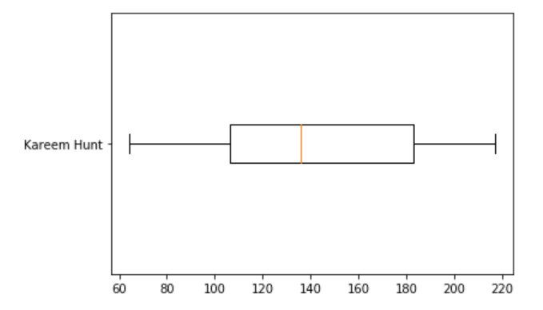

# 2020 Fantasy Football

## Part 1: Import the Data and Convert everything to a csv

### Summary

Constructing a Fantasy Football draft assistance algorithm using Gaussian Kernel Density Estimation (Gaussian KDE). 

### Context

What is Gaussian KDE?
Why use it?
What do I expect to get out of it?

### Collecting, Cleaning, and Composing the Data

"DAsHA" Stands for Draft Assistance Heuristic Algorithm. 

The first notebook, "2020 Fantasy Football DAsHA data prep," cleans and merges the fantasy football projections (which were pulled 8/21/2020) and generates the KDE for each player. KDEs center a normal Gaussian distribution over each input point, then sum all of those functions to generate a non-parametric probability density function. Here is an example KDE from our data with some annotations.

This distribution is then used to generate median point estimations and confidence intervals for each player. For example, the distribution above generates the following confidence interval.

## Part 2: Create a UI to use during the draft to help with picks

The second notebook, "2020 Fantasy Football DAsHA user interface," provides a user-interface that you can use during a fantasy football draft to optimize your draft choices.

The idea here is that DAsHA will return a panel of players at each position with the highest projected points. DAsHA will also show a "marginal" score, which is how many more points this player is expected to generate compared to the best player at the same position who will be available in the next round. 

For example, if the top RB available now is projected to get 150 points, but the top RB that will be available during your next pick is projected to get 100 points, the marginal score will be 50. However, if the top kicker available this round will also be available next round, the marginal score for drafting that kicker will be 0. In general, you should draft the player with the highest marginal score. DAsHA will also return a chart of confidence intervals of each player in the panel generated above. This lets you select based on variance as well as projected points.

Finally, DAsHa generates graphs comparing the players at the two positions with the highest point projections to the next best option available at that position in the current round. This again is so that you can make an informed decision based on the variance / distribution of point projections in addition to the raw point totals. For example, the tails on either side show upside / downside potential. Depending on your draft position, you may be willing to accept a player with a lower median projection but higher upside as opposed to locking in a player with a higher median point projection, but very low variance.

An example of DAsHA's menu output is:

